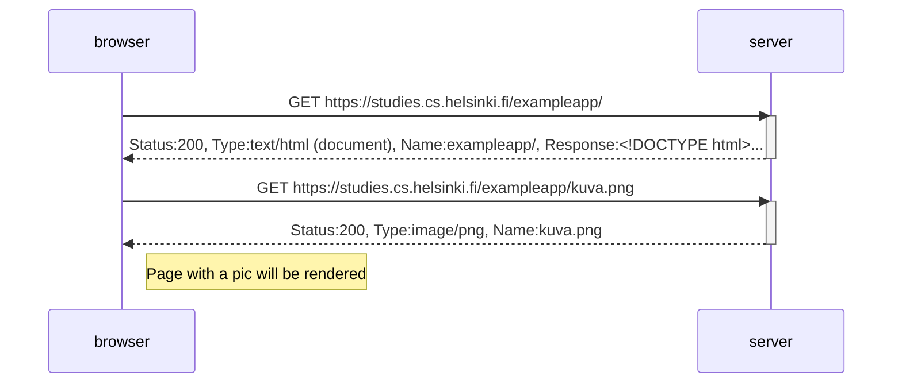
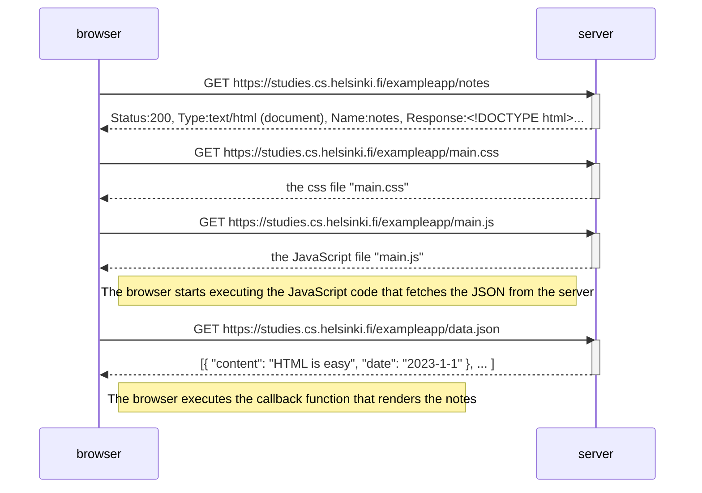
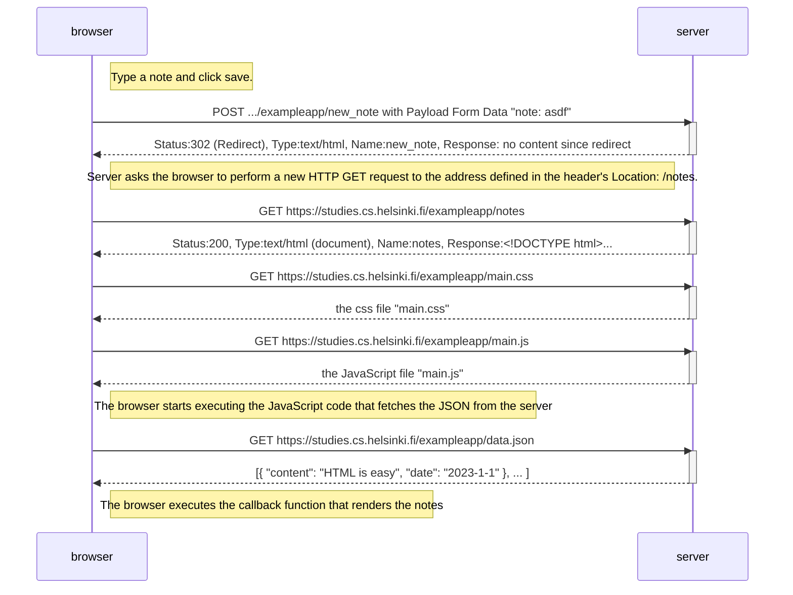
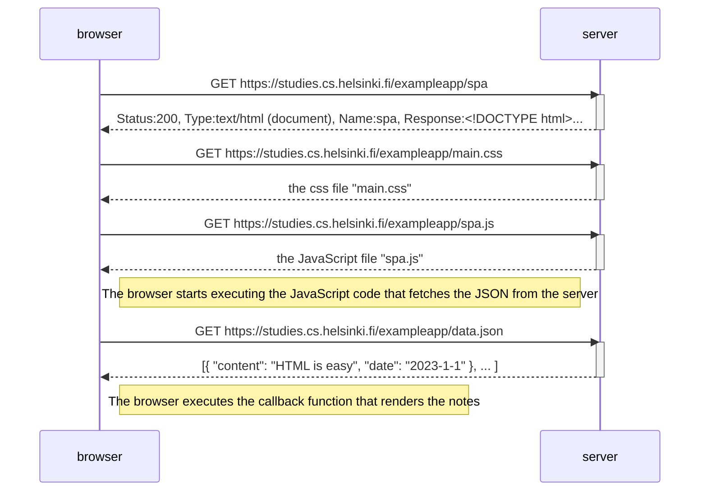
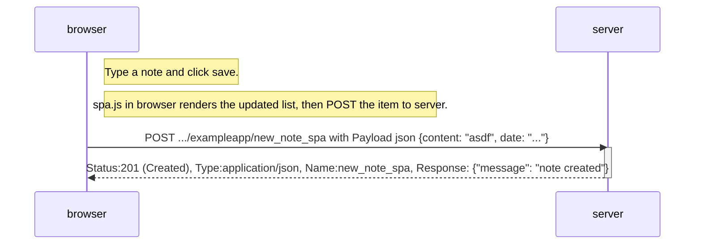

[link](./child.md#test)


# Traditional web application (Server-Side Rendering SSR)
"The server has formed this HTML document somehow. The document can be a static text file saved into the server's directory or formed the HTML documents dynamically according to the application's code, using, for example, data from a database."

When loading https://studies.cs.helsinki.fi/exampleapp the sequence diagram is:

The HTML code of the homepage is formed dynamically **on the server** as:
```js
const getFrontPageHtml = noteCount => {
  return `
    <!DOCTYPE html>
    <html>
      <head>
      </head>
      <body>
        <div class='container'>
          <h1>Full stack example app</h1>
          <p>number of notes created ${noteCount}</p>
          <a href='/notes'>notes</a>
          
        </div>
      </body>
    </html>
`
}

app.get('/', (req, res) => {
  const page = getFrontPageHtml(notes.length)
  res.send(page)
})
```

# Loading a page containing JavaScript - review (Client-Side Rendering CSR)

When loading https://studies.cs.helsinki.fi/exampleapp/notes the sequence diagram is:


The HTML document that the server returns:
```html
<!DOCTYPE html>
<html>
<head>
  <link rel="stylesheet" type="text/css" href="/exampleapp/main.css" />
  <script type="text/javascript" src="/exampleapp/main.js"></script>
</head>
<body>
  <div class='container'>
    <h1>Notes</h1>
    <div id='notes'>
    </div>
    <form action='/exampleapp/new_note' method='POST'>
      <input type="text" name="note"><br>
      <input type="submit" value="Save">
    </form>
  </div>
</body>
</html>
```
`main.js` that the browser runs to fetch data and create the list:
```js
var xhttp = new XMLHttpRequest()
  
xhttp.onreadystatechange = function () {
  if (this.readyState == 4 && this.status == 200) {
    const data = JSON.parse(this.responseText)
    console.log(data)

    var ul = document.createElement('ul')
    ul.setAttribute('class', 'notes')

    data.forEach(function(note){
      var li = document.createElement('li')
      
      ul.appendChild(li);
      li.appendChild(document.createTextNode(note.content))
    })

    document.getElementById("notes").appendChild(ul)
  }
}

xhttp.open("GET", "/exampleapp/data.json", true)
xhttp.send()
```

# Ex 04 New note load diagram (Hybrid rendering since pressing the button triggers a full reload and client side rendering of the list?)

Sequence diagram when the user creates a new note on the page https://studies.cs.helsinki.fi/exampleapp/notes by writing something into the text field and clicking the Save button. (This diagram is the same as the previous diagram except added the form submit in the beginning.)


Server code:
```js
app.post('/new_note', (req, res) => {
  notes.push({
    content: req.body.note,
    date: new Date(),
  })

  return res.redirect('/notes')
})
```

# Ex 05 Single page app load diagram (Client-Side Rendering CSR)
(Even for )
The Notes page in ex 04 uses AJAX to fetch the notes data. Submitting the form still uses the traditional mechanism of submitting web forms. The Notes page of our application in ex 04 bears some resemblance to SPA-style apps, but it's not quite there yet. Even though the logic for rendering the notes is run on the browser, the page still uses the traditional way of adding new notes. The data is sent to the server via the form's submit, and the server instructs the browser to reload the Notes page with a redirect.

When loading the spa app https://studies.cs.helsinki.fi/exampleapp/spa the sequence diagram is the same as for the "old" app at https://studies.cs.helsinki.fi/exampleapp/notes just the URL is different.


The difference comes in the next exercise when we add a note in the spa. 

# Ex 06 Single page app new note diagram (Client-Side Rendering CSR)
Note that the form has no action or method attributes to define how and where to send the input data. Everything will be taken care of in spa.js.  

Sequence diagram wen creating a new note at https://studies.cs.helsinki.fi/exampleapp/spa:


